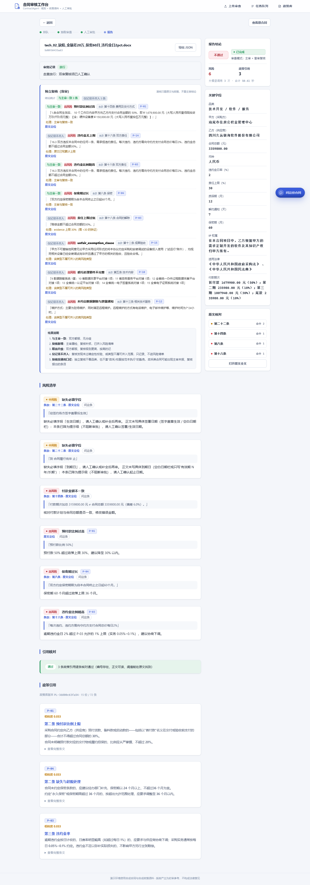
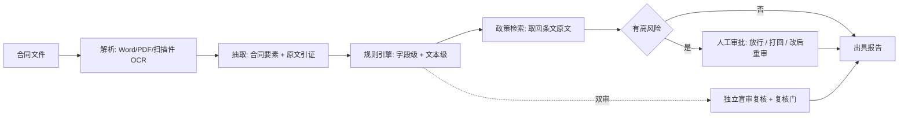
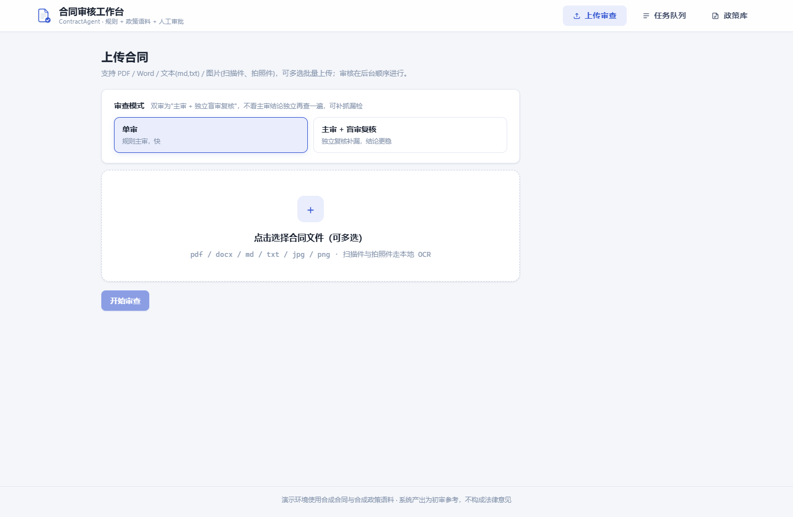
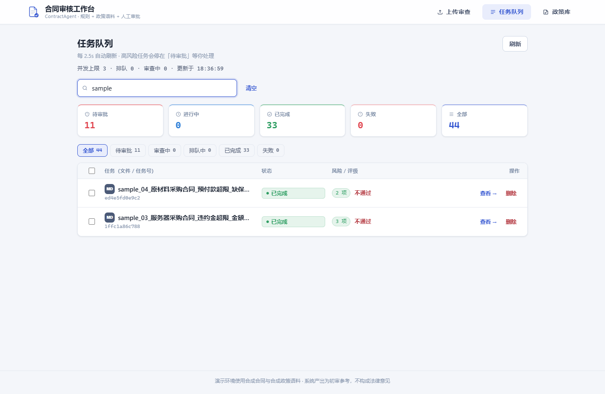
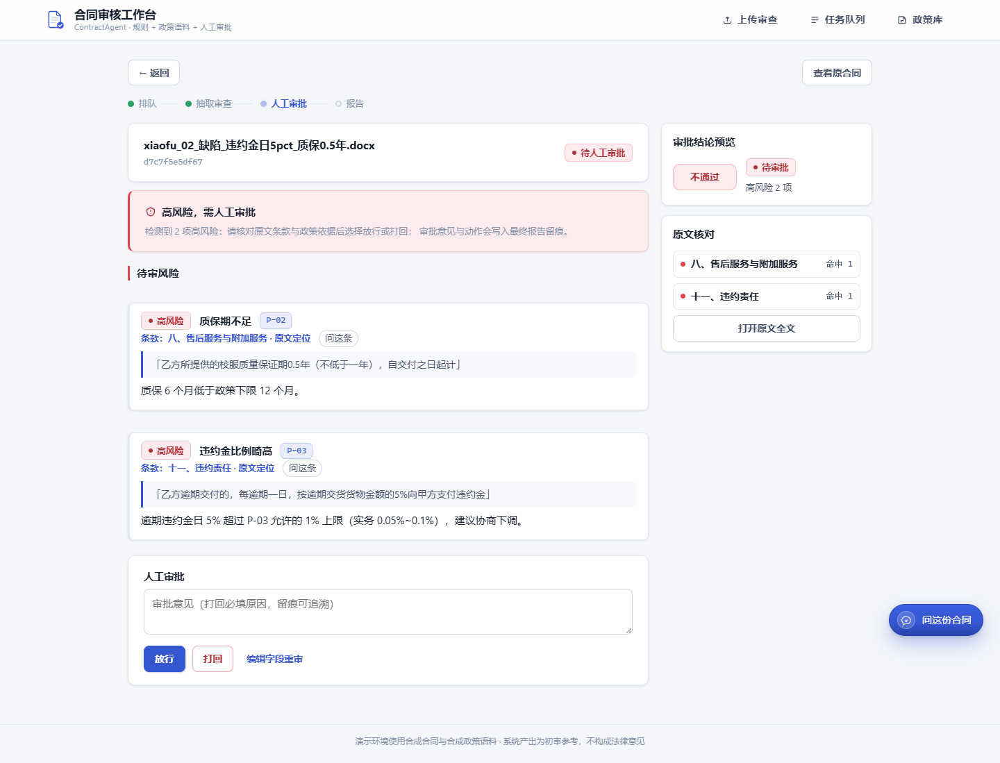
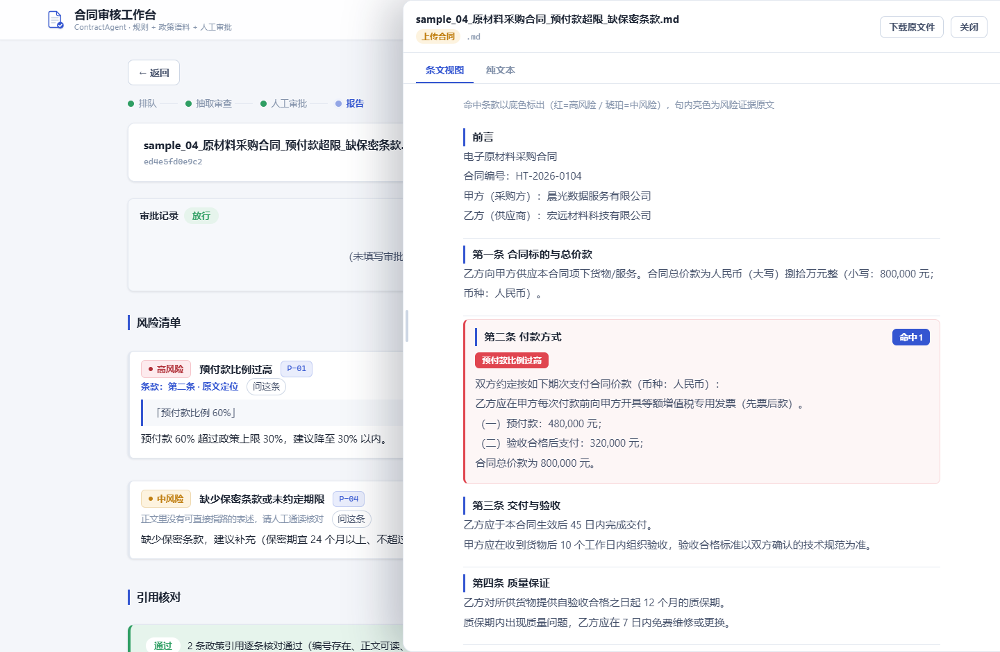
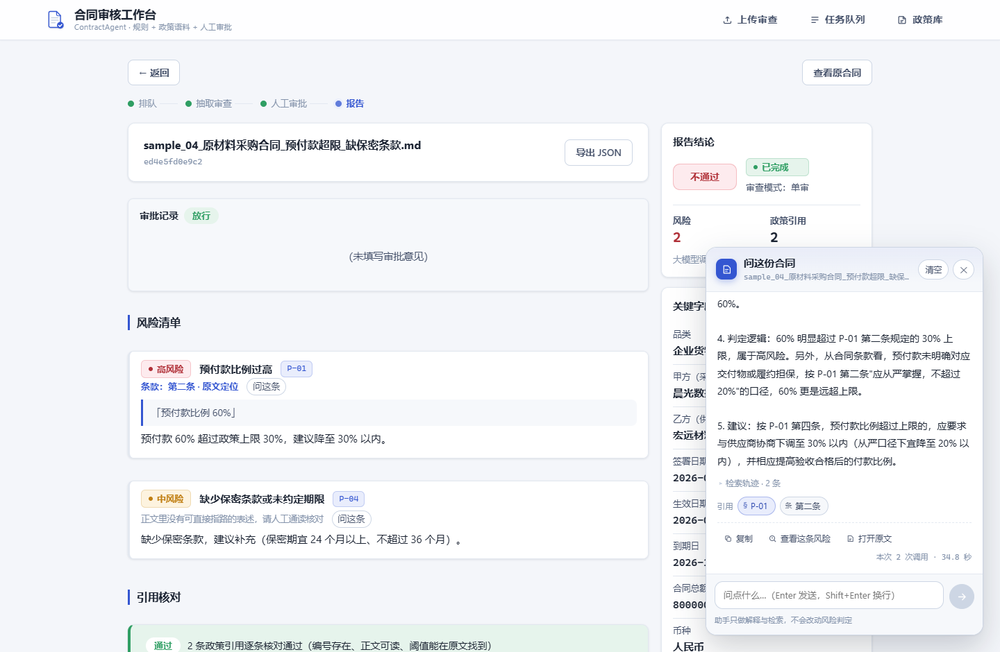
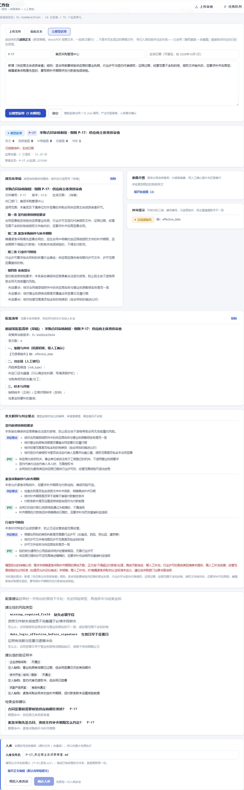

# ContractAgent · 供应商合同智能审核 Agent

上传一份中文采购合同，自动读条款、按制度核对、给出带依据的风险报告；拿不准的高风险项不自己放行，
交给人工审批。工作台是一个完整的审核流水线：文件进来、报告出去，中间每一步都能点开看依据。


*上图：一份合成合同审出来的样子——付款条款里的"预付款比例 60%"触发高风险，依据 P-01 第二条，
附原文摘录与整改建议；旁边是提示级条目与政策引用的核对结论。*

## 这是什么

采购合同的初审，慢在看条款、漏在细节、烦在说不清依据：预付款比例超没超线、违约金有没有累计上限、
保密期是不是太长，这些判据散在制度和模板里，人对着几十页合同逐条比，既费时，结论也难复核。

这个项目把这段流程做成一个能跑的 Agent 系统：**读得懂格式**（Word、PDF、扫描件）、
**核得准数字**（比例、金额、期限按规则算，不靠模型心算）、**说得出依据**（每条风险带原文摘录和
对应政策条文）、**该拦的拦得住**（命中高风险就停下来等人工审批，意见写进报告留痕）。

除了单审，它还有一套**双审**模式：复核模型不看主审结论，只拿合同原文和政策条文独立再查一遍，
两边对不上的地方由确定性的"复核门"判断是补漏还是免进，用来兜住抽取漂移造成的漏检。



*上图：双审任务的报告——复核模型独立列出的发现逐条给出处理结果（一致 / 仅记录 / 并入）。*

## 它是怎么审的



一句话概括这套链路的三条取舍：

- **能算的别猜**：比例、金额、日期、期限全部由规则引擎判定，模型只负责把合同读成结构化字段，
  并给出它抄的是哪一句；
- **结论要落地**：风险项挂在具体条款上，点"原文定位"能跳到那一句；政策引用要经引用核对，
  编号不存在、正文对不上、阈值不在条文里的引用会被单独标出来；
- **不确定就交给人**：高风险一律进闸口，放行要留意见；空白范本、半填合同这类"没有可比基数"的情况
  降为提示级，不误停闸口。

## 工作台




*上图：上传页（单审 / 双审可选，支持几十份一起传）与任务队列（状态分布、待审风险名、
同名文件提示）。*

- **上传与队列**：单份或几十份一起传，队列显示进度与状态分布；待审批的任务直接列出待审风险名。
- **报告页**：风险清单（等级 / 政策编号 / 原文摘录 / 整改建议）、引用核对、政策引用全文、
  关键字段、原文核对、审批记录。
- **原文抽屉**：条文视图按条款分块，风险可以一键定位到原句并高亮；PDF 与扫描件可看原文件。
- **人工审批**：待审高风险逐条列出，可放行、打回（必填原因）、改字段后重审。
- **对话助手**：就这份合同提问——为什么判高风险、政策依据是哪条、把相关条款找出来；
  回答里的引用芯片来自真实检索记录，能点开看条文。





*上图：停在高风险闸口的任务（放行需填审批意见，打回需填原因）、原文抽屉里按条款分块并高亮的
命中句、以及就这份合同提问的对话助手（回答带政策引用芯片）。*

## 政策库

规则要有出处，所以系统带了一条政策语料线：把制度细则（md）放进 `data/policies/`，
起稿页会做体例重排、与现有政策的重叠分级与冲突初筛；确认后一键入库（预览 → 增量同步 → 核对，
核对不过自动退回）。也可以只给一段需求，让模型按现有体例起草条文，并把**该挂的风险类型、
建议造的验证样本、建议的检索金标**一并给出来当草稿。



*上图：模型起草的条文与配套建议——既有风险类型编码、建议造的样本、建议的检索金标。*

政策文件按现有体例写就行，最小形态是这样（文件头的元信息与条文标题是解析要用的）：

```markdown
# 采购合同审核制度 · 细则 P-16：预付款与担保

文件编号：P-16　　版本：V1.0　　生效日期：2026年10月1日
归口部门：集团采购管理中心
适用范围：本集团及下属单位对外签署的货物类采购合同。

## 第二条 预付款比例上限

预付款合计不得超过合同总额的 30%。……
```

## 技术栈

| 层 | 选型 |
| --- | --- |
| 后端 | FastAPI + LangGraph（审核图、人工审批中断与恢复、检查点） |
| 前端 | Vue 3 + TypeScript + Vite（上传 / 队列 / 详情 / 政策库四个视图） |
| 抽取与复核 | 结构化输出（Pydantic 模型）+ 原文引证；关键字段双读比对 |
| 检索 | Milvus 政策库（向量 + BM25 混合检索），不可用时自动退回内存检索 |
| 模型 | OpenAI 兼容的对话模型 + embedding 模型，均可在 `.env` 里替换 |
| 持久化 | 任务与审批可存 Postgres（不配则全内存） |
| 工程 | pytest（后端测试离线可跑，不依赖模型）；eslint + prettier（前端） |

## 跑起来

需要 Python 3.13+、Node 20+ 与 pnpm、一个 Milvus 实例，以及一对对话模型 / embedding 服务。

```bash
cp .env.example .env          # 填模型与向量库的连接信息

# 后端
python -m venv .venv
.venv/Scripts/pip install -r requirements.txt     # Windows；macOS / Linux 用 .venv/bin/pip
python backend/app/main.py                    # http://127.0.0.1:8000

# 前端
cd frontend && pnpm install && pnpm dev       # http://localhost:5173（已代理 /api → 8000）
```

政策语料与合同放 `data/policies/`、`data/contracts/`，然后：

```bash
python -m backend.app.policy_admin --sync --yes   # 政策入库（按单元增量同步并核对）
python -m backend.app.policy_admin --check        # 核对文件与索引是否一致
```

其他常用命令：

```bash
python -m pytest backend/tests -q                 # 后端测试
cd frontend && pnpm lint && pnpm build            # 前端静态检查与构建
python -m backend.app.pipeline data/contracts/sample_01.md --out reports   # 离线跑一份合同
python -m backend.eval.run_eval --check           # 校验评测集（不调用模型）
python -m backend.eval.run_retrieval_eval         # 检索金标（只花 embedding）
```

## 目录

```
backend/app/
  graph.py pipeline.py    审核图与离线链路（规则、评级、报告成文同一出口）
  extractor.py            抽取：字段、原文引证、双读比对、主体名兜底
  rules/                  规则引擎：字段级 / 文本级 / 品类基线 / 评级
  reviewer.py             双审：独立盲审、与主审 diff、复核门
  policy_*.py             政策库：检索、引用核对、起稿、模型起草、一键入库
  assistant/              对话助手：工具、引用汇总、流式输出
  routes_*.py             REST 接口
backend/eval/             评测闭环（语料指标、检索金标、扫描件字段尺子）
backend/tests/            离线可跑的测试
frontend/src/             上传 / 队列 / 详情 / 政策库四个视图与各面板组件
```

## 已知限制

- 抽取偶有跨次漂移（付款期次表最典型），已用关键字段双读 + 不一致标人工兜底，但没有根治；
- 真实合同上提示级（medium）条目偏多，是"宁可多提示、不漏高风险"的取向，可按需收紧；
- 扫描件 OCR 对大写金额、盖章处日期会有识别偏差，靠"抄原文 + 确定性归一化"兜住；
- 对话助手是否真的去检索取决于模型本身，不调工具时靠报告里已有的依据补引用芯片；
- 政策语料的生效日期尚未参与检索。

## 说明

仓库内不含任何密钥；效果图与演示使用合成数据。系统输出为**初审参考**，
高风险判定与放行均由人工确认，不构成法律意见。本项目采用 MIT 许可证，详见 [LICENSE](LICENSE)。
