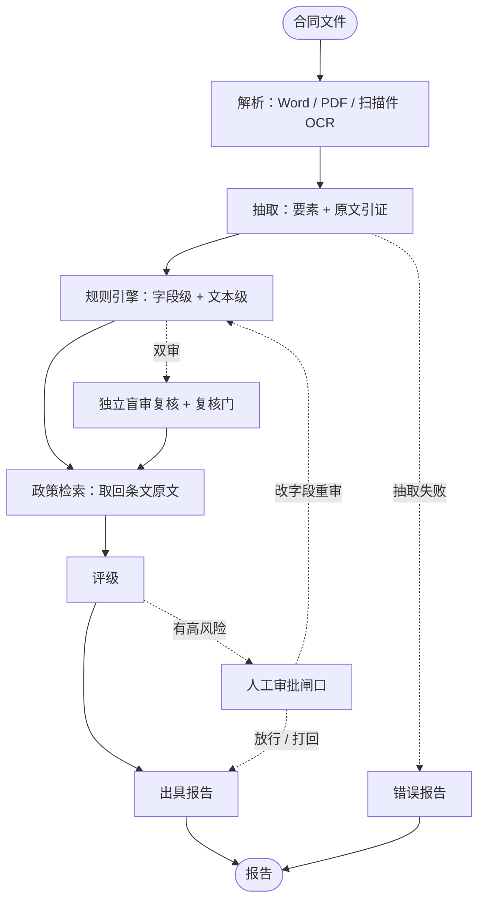
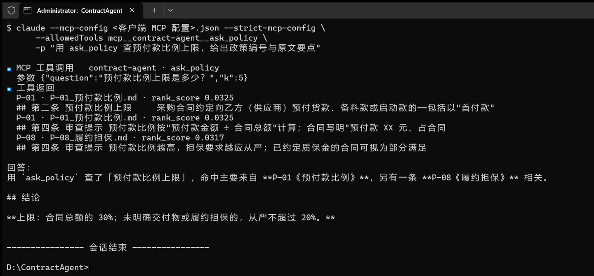

<div align="center">

# ContractAgent · 供应商合同智能审核 Agent

上传一份中文采购合同，自动读条款、按制度核对、给出带依据的风险报告；拿不准的高风险项不自己放行，
交给人工审批。工作台是一个完整的审核流水线：文件进来、报告出去，中间每一步都能点开看依据。

[](LICENSE)
[](https://www.python.org/)
[](https://nodejs.org/)


[它解决什么](#它解决什么) · [它是怎么审的](#它是怎么审的) · [三幕演示](#三幕演示) · [工作台](#工作台) ·
[政策库](#政策库) · [设计取舍](#设计取舍) · [跑起来](#跑起来) · [已知限制](#已知限制)

</div>

<div align="center">


*一份真实合同停在闸口：付款条款里的「预付款比例 100%」触发高风险，依据 P-01*
*（预付款合计不得超过合同总额的 30%），附原文摘录与整改建议；*
*右侧是审批结论预览与原文核对，下方是放行 / 打回入口。*

</div>

## 它解决什么

采购合同的初审，慢在看条款、漏在细节、烦在说不清依据：预付款比例超没超线、违约金有没有累计上限、
保密期是不是太长，这些判据散在制度和模板里，人对着几十页合同逐条比，既费时，结论也难复核。

**这个项目把这段流程做成一条能跑的流水线：合同进来、报告出去，中间每一步都能点开看依据。**
五条底线写在规则里：

| 能力 | 做到什么 |
| --- | --- |
| **读得懂格式** | Word、PDF、扫描件（OCR）进来就是结构化要素：金额、日期、比例、主体 |
| **核得准数字** | 比例、金额、期限由规则引擎判定，模型只负责读合同、抄出依据句 |
| **说得出依据** | 每条风险挂原文摘录与政策条文编号，引用要过"引用核对"这一关 |
| **该拦的拦得住** | 命中高风险就停在闸口，放行要留意见、打回要填原因，全程留痕 |
| **兜得住漏检** | 双审模式：复核模型不看主审结论，独立再查一遍，两边对不上由复核门裁决 |

双审是这套系统里"多 agent"的那一半：主审读原文、抽字段、跑规则；复核只拿合同原文和政策条文，
自己列一遍高风险清单；两份清单 diff 之后——一致的忽略、复核新增的并入、严重度分歧取高的——
真正拿不准的才进闸口，既不白拦也不漏拦。

<div align="center">


*双审任务的报告：复核模型独立列出的发现逐条给出处理结果（一致 / 仅记录 / 并入），*
*下面接着是风险清单、引用核对与政策引用原文。*

</div>

## 它是怎么审的



*上面是审核图的实际节点与条件分支（实线＝固定流转，虚线＝条件分支）：由编译后的图导出
（`graph.get_graph().draw_mermaid()`），节点名手工换成中文。右下角那条 `闸口 → 规则引擎` 的回环，
就是"改字段重审"走的路径。*

这条链路上六个环节各管一段：

- **解析**：Word（含表格）、PDF 直读，扫描件走 OCR；正文按条款切块，往后每一步都能回指原文；
- **抽取**：模型按给定字段填结构化结果，每个字段附上它抄的是哪一句；金额、比例、日期再经确定性
  归一化（中文数字、大写金额、日期格式）；
- **规则引擎**：字段级规则（比例上限、金额对不对得上、日期先后）与文本级规则（条款缺失、
  表述倒挂）两组并跑，按合同品类挑"应含条款"基线，不把品类正常的省略当成缺陷；
- **政策检索**：向量 + BM25 混合取回条文原文；报告里的引用要能对上政策正文，编号不存在、
  正文对不上、阈值不在条文里的引用会被单独标出来；
- **闸口**：命中高风险就停下来等人工放行 / 打回 / 改后重审；没有高风险直接出报告，空白范本、
  半填合同这类"没有可比基数"的情况降为提示级，不误停闸口；
- **双审**（可选）：复核模型独立再查一遍，与主审结论 diff 后由复核门决定并入还是仅记录。

## 三幕演示

验收标准就是这三幕，README 里的效果图也出自同一条流程：

| | 剧本 | 看点 |
| --- | --- | --- |
| 一 | **正常合同放行** | 一份没有缺陷的采购合同传进来，全自动出报告，评级「通过」，无人工介入 |
| 二 | **高风险拦截** | 预付款超限、违约金畸高这类条款命中高风险 → 停在闸口 → 人打回并写明原因 → Agent 恢复并把这条意见写进报告留痕 |
| 三 | **批量队列** | 一次多选上传几十份（Word / PDF / 扫描件混着）→ 逐份处理、进度可视、各自出报告 |

第三幕是实测过的：40 份真实素材一次性上传跑完，0 失败 0 报错，其中 12 份停在人工审批等你处理。

## 工作台

**四个视图：上传、队列、任务详情（报告与审批）、政策库。挑几张面板看一下。**

<div align="center">


*上传页（单审 / 双审可选，支持几十份一起传）与任务队列：状态分布、待审任务直接列出待审风险名、
同名文件会标出来。*

</div>

- **上传与队列**：单份或几十份一起传，队列显示进度与状态分布；待审批的任务直接列出待审风险名。
- **报告页**：风险清单（等级 / 政策编号 / 原文摘录 / 整改建议）、引用核对、政策引用全文、
  关键字段、原文核对、审批记录。
- **原文抽屉**：条文视图按条款分块，风险可以一键定位到原句并高亮；PDF 与扫描件可看原文件。
- **人工审批**：待审高风险逐条列出，可放行、打回（必填原因）、改字段后重审。
- **对话助手**：就这份合同提问——为什么判高风险、政策依据是哪条、把相关条款找出来；
  回答里的引用芯片来自真实检索记录，能点开看条文。

<div align="center">


*依次是：停在高风险闸口的合同（两条违约金口径——比例畸高、无累计上限）、原文抽屉里按条款分块并
高亮的命中句（点风险卡上的「原文定位」会直接滚到那一句）、以及就这份合同提问的对话助手。*

</div>

## 政策库

**规则要有出处：政策条文进得了库、查得到、报告里的引用对得上，审查结论才站得住。**

系统因此带了一条政策语料线：把制度细则（md）放进 `data/policies/`，
起稿页会做体例重排、与现有政策的重叠分级与冲突初筛；确认后一键入库（预览 → 增量同步 → 核对，
核对不过自动退回）。也可以只给一段需求，让模型按现有体例起草条文，并把**该挂的风险类型、
建议造的验证样本、建议的检索标准答案**一并给出来当草稿。

<div align="center">


*模型起草的条文与配套建议：该挂的既有风险类型编码、建议造的验证样本、建议的检索标准答案；*
*右边是重叠分级与冲突初筛，底部是入库预览——确认之前不动真库。*

</div>

政策文件按现有体例写就行。注意**文件名要以编号开头**（`P-16_预付款与担保.md`）——不带头编号的
.md 会被跳过、不进检索库；正文最小形态是这样（文件头元信息与条文标题是解析要用的）：

```markdown
# 采购合同审核制度 · 细则 P-16：预付款与担保

文件编号：P-16　　版本：V1.0　　生效日期：2026年10月1日
归口部门：集团采购管理中心
适用范围：本集团及下属单位对外签署的货物类采购合同。

## 第一条 预付款比例上限

预付款合计不得超过合同总额的 30%。……
```

## 作为 MCP 服务端

**同一套审查能力，也能被 AI 客户端当工具调。**

除了工作台，审查能力还以 MCP（Model Context Protocol）服务端的形式暴露出来，
入口是 `backend/app/mcp_server.py`，传输用 **stdio**（本地单人、零部署、零鉴权）。
四个工具：

| 工具 | 做什么 |
| --- | --- |
| `submit_contract` | 提交本机合同文件，登记审查任务，立刻回任务号 |
| `get_report` | 按任务号取状态与报告（评级 / 风险清单 / 关键字段；闸口态给待审高风险） |
| `ask_policy` | 按问题检索政策库，回命中条文的编号、出处与原文 |
| `ask_contract` | 就某份合同提问：解释判定、查政策依据、找条款原文 |

一次审查要跑模型（单份 30~120 秒），所以提交与取结果分开：**提交拿任务号，再轮询取报告**，
不阻塞客户端。服务端复用工作台那套 `TaskManager`、政策检索与对话助手，判定逻辑一行不改。

在 Claude Code / Cursor 这类客户端里配 stdio 命令即可（工作目录指向仓库根）：

```json
{
  "mcpServers": {
    "contract-agent": {
      "command": "D:/ContractAgent/.venv/Scripts/python.exe",
      "args": ["backend/app/mcp_server.py"]
    }
  }
}
```

本机试一下：`claude --mcp-config <上面的 json> --strict-mcp-config -p "用 ask_policy 查预付款比例上限"`。

<div align="center">



*一次真实会话：客户端按工具描述自己选中 `ask_policy`，子进程就是上面这个 MCP 服务端；*
*工具返回的是政策库真实命中的条文（编号、出处、融合分），回答里的政策编号与阈值都来自它。*

</div>

## 设计取舍

**这几条贯穿全项目，也是它跟"调个模型读合同"的区别。**

- **能算的别猜**：比例、金额、日期、期限一律由规则引擎判定，模型只负责把合同读成结构化字段、
  并给出它是从哪一句抄的——报告里的数不该由模型心算；
- **要判断就找依据**：结论落在具体条款与政策条文上，引用还要再过一道核对；编号不存在、
  正文对不上、阈值在条文里找不到的引用，单独标出来给人看，不装作没问题；
- **复核要独立上下文**：盲审只拿合同原文和政策条文，不看主审抽取了什么、判了什么；
  适用范围这类确定性信息不塞给模型，交给确定性的复核门补——上下文递过去，复核就不叫复核了；
- **不确定就交给人**：高风险一律进闸口、放行留意见；没有可比基数的情形（空白范本、半填合同）
  降为提示级，不误停闸口；
- **同一份口径只写一处**：规则与复核门共用的豁免存成一份常量两边引，改一处就够，
  免得一边改了、另一边照旧。

## 技术栈

| 层 | 选型 |
| --- | --- |
| 后端 | FastAPI + LangGraph（审核图、人工审批中断与恢复、检查点） |
| 前端 | Vue 3 + TypeScript + Vite（上传 / 队列 / 详情 / 政策库四个视图） |
| 抽取与复核 | 结构化输出（Pydantic 模型）+ 原文引证；关键字段双读比对 |
| 检索 | Milvus 政策库（向量 + BM25 混合检索），不可用时自动退回内存检索 |
| 模型 | OpenAI 兼容的对话模型 + embedding 模型，均可在 `.env` 里替换 |
| 持久化 | 任务与审批可存 Postgres（不配则全内存） |
| 接入 | MCP 服务端（stdio）：提交合同 / 取报告 / 问政策库 / 问合同四个工具 |
| 工程 | pytest（后端测试离线可跑，不依赖模型）；eslint + prettier（前端） |

## 跑起来

需要 Python 3.13+、Node 20.19+（Vite 8 的下限）与 pnpm、一个 Milvus 实例，
以及一对对话模型 / embedding 服务。开发机是 Windows，命令按 Windows 写；macOS / Linux 把
`.venv/Scripts/` 换成 `.venv/bin/` 即可。

```bash
cp .env.example .env          # 填模型与向量库的连接信息

# 后端
python -m venv .venv
.venv/Scripts/pip install -r requirements.txt     # Windows；macOS / Linux 用 .venv/bin/pip
python backend/app/main.py                    # http://127.0.0.1:8000

# 前端
cd frontend && pnpm install && pnpm dev       # http://localhost:5173（已代理 /api → 8000）
```

政策语料与合同放 `data/policies/`、`data/contracts/`，然后：

```bash
python -m backend.app.policy.admin --sync --yes   # 政策入库（按单元增量同步并核对）
python -m backend.app.policy.admin --check        # 核对文件与索引是否一致
```

其他常用命令：

```bash
python -m pytest backend/tests -q                 # 后端测试
cd frontend && pnpm lint && pnpm build            # 前端静态检查与构建
python -m backend.app.review.pipeline data/contracts/sample_01.md --out reports   # 离线跑一份合同
python -m backend.eval.run_eval --check           # 校验评测集（不调用模型）
python -m backend.eval.run_retrieval_eval         # 检索标准答案（只花 embedding）
python backend/app/mcp_server.py                  # MCP 服务端（stdio，供 AI 客户端调用）
```

## 目录

```
backend/app/
  main.py config.py       服务入口与配置；schemas.py 跨层数据结构；llm.py / usage.py 模型调用与计数
  mcp_server.py           MCP（stdio）服务端：把审查能力暴露成四个工具供 AI 客户端调用
  api/                    HTTP 接口：任务（上传 / 队列 / 详情 / 审批 / 对话）与政策库
  review/                 审查主链路：解析、抽取、规则（rules/）、双审、审核图与离线链路
  policy/                 政策库：检索、语料核对、入库、命令行、起草与引用核对
  assistant/              对话助手：工具、引用汇总、流式输出
  tasks/                  任务队列与登记簿：worker 池、内存 / Postgres 登记簿、上传目录清理
backend/eval/             评测闭环（语料指标、检索标准答案、扫描件字段准确率）
backend/tests/            离线可跑的测试
frontend/src/             上传 / 队列 / 详情 / 政策库四个视图与各面板组件
```

## 已知限制

- 抽取偶有跨次漂移（付款期次表最典型），已用关键字段双读 + 不一致标人工兜底，但没有根治；
- 真实合同上提示级（medium）条目偏多，是"宁可多提示、不漏高风险"的取向，可按需收紧；
- 扫描件 OCR 对大写金额、盖章处日期会有识别偏差，靠"抄原文 + 确定性归一化"兜住；
- 对话助手是否真的去检索取决于模型本身，不调工具时靠报告里已有的依据补引用芯片；
- 政策语料的生效日期尚未参与检索。

## 说明

仓库内不含任何密钥。效果图取自真实合同素材（公开渠道的政府采购与行业示范文本），
政策语料为本项目自建、非任何机构的正式文件。系统输出为**初审参考**，
高风险判定与放行均由人工确认，不构成法律意见。本项目采用 MIT 许可证，详见 [LICENSE](LICENSE)。
